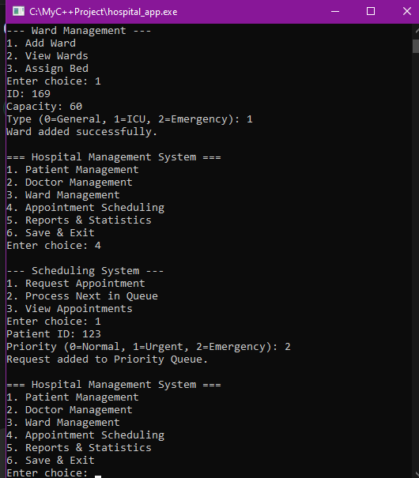
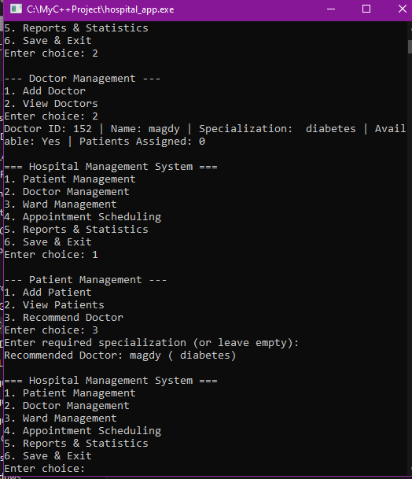
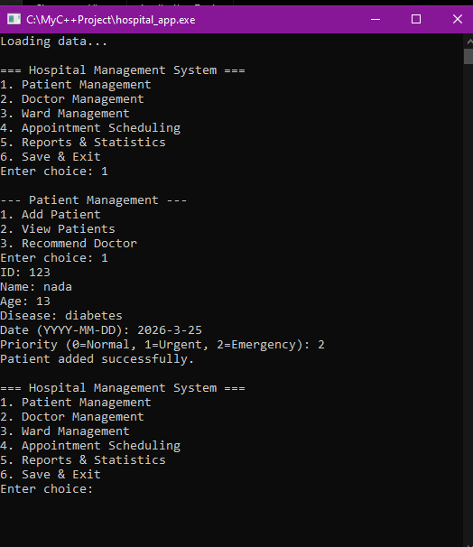

# 🏥 Hospital Management System

<div align="center">


**A fully custom-built Hospital Management System in C++17 — with zero external libraries.**

*Smart scheduling · Persistent storage · Clean OOP architecture*

</div>

---

## ✨ What Makes This Different

Most hospital systems out there are basic CRUD apps.
This one is built differently — here's what sets it apart:

| Feature | Common Projects | This Project |
|---|---|---|
| Scheduling | First come, first served | **Priority Queue (Max-Heap)** — emergencies first |
| Storage | Data lost on exit | **Full CSV persistence** — zero data loss |
| File Design | One big file | **Separate CSV per entity** — clean & fast |
| Architecture | Functions only | **Full OOP + Inheritance hierarchy** |
| Data Structures | Built-in only | **Custom `PriorityQueue<T>` template** |
| Reports | None | **Live stats + exportable report.txt** |

---

## 🚀 Core Features

### 🔴 Smart Scheduling Engine
Custom-built `PriorityQueue<T>` using a **Max-Heap** — patients are scheduled by severity level:
- `Emergency` → always first
- `Urgent` → second
- `Normal` → last
- Ties are resolved by **FCFS (First Come First Served)**

### 🗂️ Advanced File Persistence
Every entity has its **own dedicated CSV file**, managed independently via `FileHandler.h`:
- No data loss between sessions
- Fast read/write per entity
- Clean separation — patients, doctors, wards, appointments never mix

### 🏛️ OOP Inheritance Hierarchy
```
HospitalMember (base)
├── Patient
├── Doctor
└── Nurse
```
Virtual `displayDetails()` across all entities — true polymorphism.

### 📊 Reports & Statistics
- Busiest doctor by appointment count
- Bed occupancy rate per ward
- Daily patient summary
- Exportable to `data/report.txt`

### 🏨 Ward & Bed Management
- Track capacity, type (`ICU` / `General` / `Emergency`), and live occupancy
- Auto-assign bed on patient admission
- Alert when ward reaches full capacity

---

## Screenshots




---

## 📁 Project Structure

```
Hospital-Management-System/
├── include/                  # All header files
│   ├── HospitalMember.h      # Base class
│   ├── Patient.h
│   ├── Doctor.h
│   ├── Nurse.h
│   ├── Ward.h
│   ├── Appointment.h
│   ├── PriorityQueue.h       # Custom Max-Heap template
│   ├── PatientManager.h
│   ├── DoctorManager.h
│   ├── WardManager.h
│   ├── SchedulingSystem.h
│   ├── ReportGenerator.h
│   └── FileHandler.h         # Per-entity CSV handler
├── src/                      # All source files
│   └── *.cpp
├── data/                     # Auto-generated CSV files
│   └── report.txt
├── screenshots/              # Demo screenshots
├── main.cpp                  # Entry point
└── README.md
```

---

## ⚙️ Build & Run

> No installations. No external libraries. Pure Standard C++17.

```bash
# Compile
g++ -std=c++17 -Iinclude src/*.cpp main.cpp -o hospital_app

# Run
./hospital_app          # Linux / macOS
.\hospital_app.exe      # Windows
```
